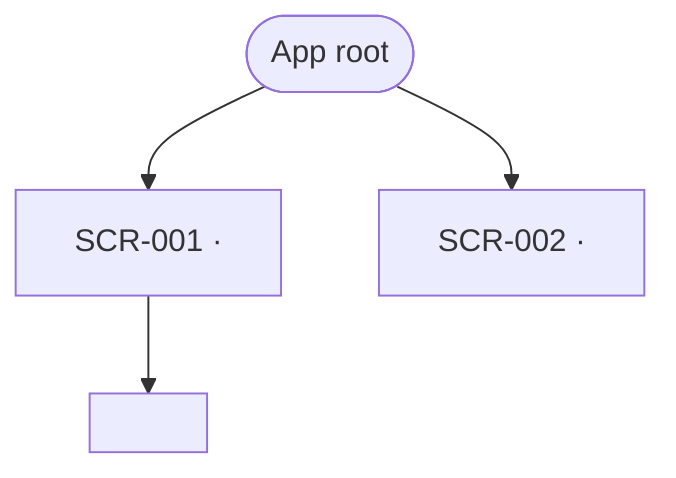
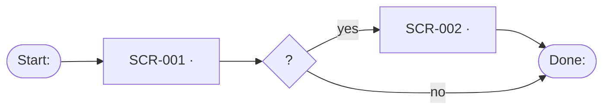

# Information architecture

> One durable file per product (`inception/design/ia.md`), extended per epic in the 2a PR. The screen inventory below is where `SCR-###` numbers are born — a screen not in this inventory has no business having a spec, and the sitemap is what makes an unreachable screen visible before CI has to say so.

## Grouping

Features grouped the way users think, in their vocabulary (research doc, Vocabulary table) — not the way the system is built. 3–6 top-level groups; fewer is better.

| Group | Contains | Nav label |
| ----- | -------- | --------- |
|       |          |           |

## Sitemap

Every level-1 screen carries a SCR-ID; sub-views live under their parent without one. A node with no parent is an IA bug, not a diagram style.

## Navigation model

**Pattern:** <persistent sidebar / top bar / hub-and-spoke / bottom tabs>
**Why this one:** <one sentence tied to the primary persona's context>

## Critical paths

One diagram per job-to-be-done — never all jobs in one diagram. Every screen in the inventory should appear in at least one path; one that appears in none is decoration wearing a REQ badge.

### Path 1 — <job, e.g. "first borrow">

## Screen inventory

The confirmed list. Each row becomes one `SCR-###` spec; `Reached from` / `Leads to` land in the spec and in `manifest.json` (`screens[].links_to`, `entry`).

| SCR-ID  | Screen | Level | Reached from | Leads to | Serves |
| ------- | ------ | ----- | ------------ | -------- | ------ |
| SCR-001 |        | L1    | entry        |          | REQ-### |
